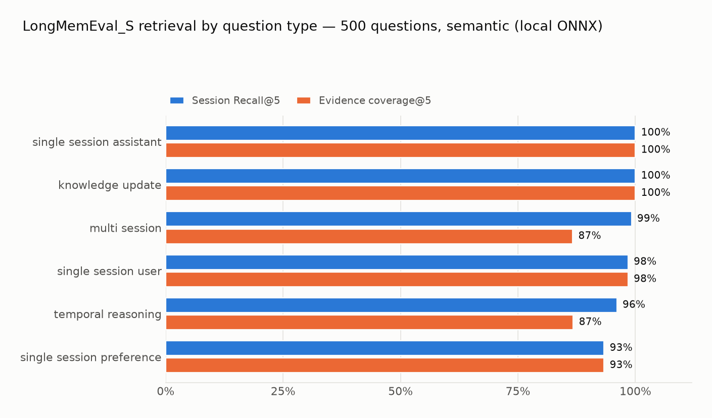
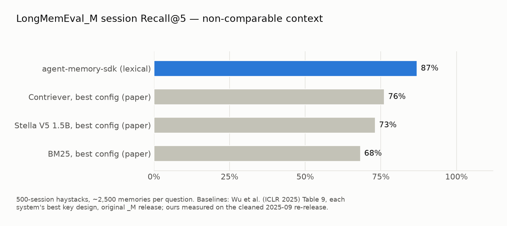

# LongMemEval Retrieval-Proxy Report — agent-memory-sdk

**TL;DR:** On LongMemEval_S (500 questions, ~48-session chat haystacks, ICLR 2025),
agent-memory-sdk reaches **98.1% session Recall@5** with local semantic embeddings
(96.0% lexical-only), **10–20ms median query latency**, and **$0 / zero LLM calls**
for ingesting 124K turn-pair entries across 500 independent runs. On the harder
**LongMemEval_M** (500-session haystacks, ~2,500 turn-pair entries per queried
store), our lexical pipeline scores **87.0% session Recall@5**. This is a
retrieval-proxy result on the cleaned release, not a head-to-head with the
paper's original-release session-index baselines. We also report a **negative result**: retrieval-level
abstention ("the answer isn't in memory") is not reliably detectable from lexical
signals — we ship that gate off by default rather than publish a misleading win.
Semantic mode improves abstention (11/30) and eliminates both wrong-REPLAY cases,
but needs per-mode threshold calibration (see below).

All numbers are reproducible from this directory. No LLM was used anywhere in this
evaluation — which is the point.

---

## Scope — what this benchmark does and doesn't test

LongMemEval tests **conversational assistant memory**: ingest a long chat
history, answer new questions about it later. That exercises exactly one slice
of agent-memory-sdk — the retrieval tier behind RESTORE and
`PagedMemory`/`from_conversation` — plus the NONE action (abstention).

The runner is a **retrieval proxy**, not LongMemEval's official end-to-end
evaluation: it indexes consecutive user/assistant turn pairs, retrieves those
pairs, and scores whether their session IDs contain labelled evidence. It does
not generate an answer, invoke the benchmark's QA judge, preserve the supplied
session timestamps, or benchmark a single persistent corpus shared by all 500
questions.

It does **not** test the SDK's differentiating layer:

- **REPLAY** (semantic answer caching): no query in the dataset repeats a
  stored one, so there is nothing legitimately replayable. The benchmark can
  only show replay misfiring — which is useful as a safety check, not as a
  measure of its value.
- **VERIFY** (staleness protection): the dataset has no external truth to
  validate against.
- Confidence learning, TTL, and decision explainability are out of scope.

Those are covered by the SDK's internal 36-case adversarial suite; to our
knowledge **no public benchmark for memory decision layers exists**. The
workload where the decision layer pays off — repeated queries with a
replay-vs-LLM cost curve — is a benchmark we plan to build and publish
(see Roadmap).

Read the numbers below accordingly: they validate that the retrieval tier is
strong on the use case where this SDK is *least* differentiated, on the shared
yardstick that Zep [2] also publishes on.

## Why retrieval-only?

[LongMemEval](https://github.com/xiaowu0162/LongMemEval) [1] labels the evidence
sessions for every question, so retrieval quality can be measured *without* an
LLM answering stage or an LLM judge. agent-memory-sdk is a retrieval + decision
layer, not an answer generator — this measures exactly the layer we ship.
Retrieval recall is the *ceiling* on end-to-end QA accuracy: an answer stage can
only work with what retrieval surfaces.

An end-to-end stage (LLM answers + the benchmark's official GPT-4o judge, directly
comparable to [Zep's published results](https://arxiv.org/abs/2501.13956)) is the
next step — see Roadmap.

## Setup

- **Dataset:** `longmemeval_s_cleaned.json` (500 questions; mean 47.7 sessions and
  ~250 user→assistant exchanges per haystack; 30 abstention questions).
- **Ingestion:** one fresh SQLite store per question. Consecutive user→assistant
  turns are paired into one experience entry (`remember(user, assistant)`), session
  id kept in metadata. 124,362 entries total.
- **Retrieval:** `retriever.retrieve(question, top_k=10, diversify_key="session_id")`
  — hybrid FTS5 BM25 + RRF fusion, lexical-only (no embedding model).
- **Decision:** `resolve(question)` with default thresholds.
- **Hardware:** single process, M-series MacBook, local SQLite file.

Reproduce:

```bash
cd benchmarks/longmemeval
wget https://huggingface.co/datasets/xiaowu0162/longmemeval-cleaned/resolve/main/longmemeval_s_cleaned.json -P data/
uv run python run_retrieval.py --semantic      # 98.1% _S semantic run, ~1.7h
uv run python run_retrieval.py                 # 96.0% _S lexical run, ~10 min
```

### Windows (PowerShell)

The same benchmark command works on Windows, macOS, and Linux. The runner
detects the host OS for resource telemetry automatically; no platform flag is
needed. For a native Windows setup, install Git and `uv` from an elevated
PowerShell, then open a new terminal:

```powershell
winget install --id Git.Git -e
winget install --id astral-sh.uv -e
```

Clone the repository, install Python and the project dependencies, then fetch
the cleaned dataset:

```powershell
git clone https://github.com/TheProdSDE/agent-memory-sdk.git
Set-Location agent-memory-sdk
uv python install 3.12
uv sync
New-Item -ItemType Directory -Force benchmarks/longmemeval/data
Invoke-WebRequest -Uri "https://huggingface.co/datasets/xiaowu0162/longmemeval-cleaned/resolve/main/longmemeval_s_cleaned.json" -OutFile "benchmarks/longmemeval/data/longmemeval_s_cleaned.json"
```

Run a smoke test, then the full lexical benchmark. Results and checkpoints are
written under the Windows temporary directory so the checked-in artifacts are
left untouched:

```powershell
uv run python benchmarks/longmemeval/run_retrieval.py --limit 1 --out "$env:TEMP/longmemeval-smoke.json"
uv run python benchmarks/longmemeval/run_retrieval.py --out "$env:TEMP/longmemeval-s-lexical.json" --checkpoint "$env:TEMP/longmemeval-s-lexical.checkpoint.json"
```

For semantic retrieval, install the optional embedding dependencies with
`uv sync --extra semantic`, then add `--semantic` to the full-run command. To
resume an interrupted run, reuse its checkpoint path and add `--resume`.

For an interruption-safe full semantic run, add a checkpoint and resume with
the same command after an interruption:

```bash
uv run python run_retrieval.py --semantic \
  --checkpoint /tmp/longmemeval-s-semantic.checkpoint.json
uv run python run_retrieval.py --semantic \
  --checkpoint /tmp/longmemeval-s-semantic.checkpoint.json --resume
```

## Measurement contract

Each full result file records the following values from the same run:

- **Accuracy:** session Recall@5/10, evidence coverage@5/10, abstention NONE
  rate, and false-abstention rate.
- **Per-query retrieval latency:** p50, p90, p95, p99, and mean. This wraps
  only `retriever.retrieve()` and is the latency relevant to serving a query.
- **Whole-run resources:** wall time, user CPU time, system CPU time, and
  process peak RSS. These include ingestion, SQLite work, and (in semantic
  mode) local model inference; they must not be interpreted as per-query
  serving cost.

The runner uses nearest-rank percentiles. On macOS, peak RSS is reported from
`getrusage()` in bytes and normalized to MiB; on Linux it is normalized from
KiB. On Windows, peak working set is read through `GetProcessMemoryInfo()` and
normalized to MiB. CPU time uses `os.times()` on all platforms. Checkpoints
write completed rows atomically every ten questions by default and do not
change the query, index, or scoring configuration.

The optional cross-haystack embedding cache is **disabled by default** and is
bounded when enabled with `--embedding-cache-size`. Its retained float32 vector
payload is reported separately in result JSON. This prevents cache retention
from being mistaken for the SDK's normal persistent-store memory use.

### Re-verified after the retrieval-path changes

The retriever gained two things while the Decision Safety Suite was being built:
an expiry check on query-cache hits, and an optional `where` predicate (with a
deeper-pool escalation) used by tenant-scoped views. Both are inert here — these
haystacks set no TTL, and the benchmark passes no predicate — but "should be
inert" is not a measurement, so **both configurations were re-run end to end**
over all 500 questions and compared against the previous artifacts:

| | Lexical | Semantic |
|---|---|---|
| All 45 accuracy metrics (overall + per type) | **identical** | **identical** |
| Query p50 — previous → re-run | 10.09ms → 10.04ms | 19.98ms → 19.56ms |
| Ingest wall time — previous → re-run | 211.6s → 204.5s | 6,180.6s → 6,921.0s |
| Entries ingested | 124,362 (unchanged) | 124,362 (unchanged) |

Every recall, coverage, abstention, and false-abstention figure matched exactly
in both configurations. Latency and ingest wall-time differ by run-to-run machine
variance in both directions — lexical ingest was 3% faster, semantic 12% slower —
while the entry count is identical, which rules out any change in what was
indexed. The re-run artifacts replace the previous ones because they also carry
the full latency percentiles and the `execution` telemetry block; accuracy
numbers throughout this report stand unchanged.

## Results



Two configurations, both fully local and $0: **lexical** (FTS5 BM25, no embedding
model) and **semantic** (adds local ONNX bge-small embeddings + sqlite-vec KNN,
hybrid RRF fusion; embedding input truncated to 1,000 chars).

| Metric | Lexical | Semantic |
|---|---|---|
| Session Recall@5 | 96.0% | **98.1%** |
| Session Recall@10 | 97.9% | **98.5%** |
| Evidence coverage@5 | 88.9% | **92.4%** |
| single-session-preference R@5 | 83.3% | **93.3%** |
| multi-session R@5 | 95.9% | **99.2%** |
| Abstention → NONE | 1/30 | **11/30** |
| Abstention → wrong REPLAY | 2/30 | **0/30** |
| Retrieval latency p50 / p90 / p95 / p99 | 10.04 / 11.85 / 12.95 / 20.21ms | 19.56 / 25.61 / 29.03 / 41.28ms |
| Ingestion (124,362 entries) | 204.5s · 608.0/s · $0 | 6,921.0s · 18.0/s · $0 |
| Whole-run wall time | 215.23s | 6,940.60s |
| Whole-run CPU (user + system) | 166.37s + 37.56s | 32,202.15s + 286.40s |
| Process peak RSS | 2,661.36MiB | 3,335.83MiB |

**Provenance of this table.** Every lexical figure comes from
`results_lexical_500q_final.json` and every semantic figure from
`results_semantic_500q_final.json` — accuracy, latency, and resources from the
same run in each column, so the table is reproducible from this directory as
claimed above.

An earlier revision quoted lexical p50 9.77ms and semantic p50 19.44ms with
whole-run CPU and a 9,453.72MiB semantic peak RSS. Those came from *different*
runs of the same configurations whose telemetry was never committed — the
semantic figures were not present in any file in this repository — and mixing
them with accuracy numbers from the committed artifacts broke this report's own
measurement contract. Both configurations were therefore re-run end to end and
their complete artifacts committed. **All 45 accuracy metrics in both
configurations came back identical to the previous artifacts**; only latency,
ingest wall-time, and resource figures moved, which is why those are the only
numbers in this table that changed.

The semantic peak RSS is the clearest difference: 3,335.83MiB measured here
against the 9,453.72MiB previously quoted, consistent with the older figure
coming from the pre-batching harness with an unbounded cross-haystack cache.

Per question type (Recall@5, lexical → semantic):

| Question type | n | Lexical | Semantic | Coverage@5 (sem.) |
|---|---|---|---|---|
| knowledge-update | 72 | 100% | **100%** | 100% |
| single-session-assistant | 56 | 100% | **100%** | 100% |
| single-session-user | 64 | 98.4% | 98.4% | 98.4% |
| multi-session | 121 | 95.9% | **99.2%** | 86.7% |
| temporal-reasoning | 127 | 93.7% | **96.1%** | 86.8% |
| single-session-preference | 30 | 83.3% | **93.3%** | 93.3% |
| **Overall** | 500 | 96.0% | **98.1%** | 92.4% |

**A calibration caveat found by this run:** with embeddings on, the decision
layer's default thresholds (calibrated on lexical score scales) refuse memory
(NONE) on 16.2% of answerable questions — embedding similarity runs on a lower
numeric scale than BM25 coverage, so the same `restore_threshold` is stricter
in semantic mode. Retrieval itself is unaffected (98.1% recall above). The
flip side of the same shift: abstention detection improves 1/30 → 11/30, and
the two rare-token wrong REPLAYs from lexical mode are both eliminated (the
embedding model correctly scores "visiting parts of Asia" as a weak match for
"how long was I in Korea"). Per-mode threshold calibration is roadmap work.

*Recall@k*: ≥1 labelled evidence session in the top-k (deduped by session).
*Coverage@k*: fraction of a question's evidence sessions found (matters for
multi-session questions, which need up to 5 distinct sessions).

**Resource measurements** — each value from the committed artifact named beside it:

| Metric | Value | Source |
|---|---|---|
| Lexical retrieval latency | p50 10.04ms · p90 11.85ms · p95 12.95ms · p99 20.21ms | `results_lexical_500q_final.json` |
| Semantic retrieval latency | p50 19.56ms · p90 25.61ms · p95 29.03ms · p99 41.28ms | `results_semantic_500q_final.json` |
| Lexical whole run | 215.23s wall · 203.93s CPU · 2,661.36MiB peak RSS | `results_lexical_500q_final.json` |
| Semantic whole run | 6,940.60s wall · 32,488.55s CPU · 3,335.83MiB peak RSS | `results_semantic_500q_final.json` |
| Ingestion | 124,362 entries · **0 LLM calls · $0.00 API cost** | both artifacts |
| Decision (resolve) false-abstention rate | 1.9% (lexical) · 16.2% (semantic) | both artifacts |

> **Resource interpretation:** semantic mode's cost is CPU, not memory —
> 32,488.55s of CPU across a 6,940.60s wall-clock run (local ONNX inference over
> 124,362 entries, parallel across cores) against a 3,335.83MiB peak. These are
> whole-run ingestion figures for 500 independent stores and must not be read as
> per-query serving cost. The persistent-store profiles below are the relevant
> measure of what one store actually costs to keep.

### Persistent-store memory profiles

Measured separately with `scripts/stress_test.py` on the same M-series MacBook,
no LRU cache, using one persistent SQLite store rather than 500 temporary
LongMemEval stores:

| Configuration | Store | RSS after retrieval | Retrieval p50 / p95 / p99 | Notes |
|---|---:|---:|---|---|
| Lexical FTS5 | 10,000 entries | 95.6MiB | 0.86 / 1.39 / 1.78ms | Embeddings forced off |
| Local ONNX + sqlite-vec | 1,000 entries | 344.0MiB | 4.77 / 6.08 / 6.59ms | `BAAI/bge-small-en-v1.5`; 64-entry backfill batches |

These are process endpoint RSS measurements from `psutil`, not a cross-tool
comparison. They establish a local SDK baseline; matching hardware, corpus,
model, and retrieval-unit experiments are required before comparing memory use
with hosted or LLM-backed systems.

## Larger-haystack test: LongMemEval_M

The `_S` numbers above can be criticised as "the easy variant." So we also ran
**LongMemEval_M**: the same 500 questions, but each haystack is ~500 sessions
(~2,470 turn-pair entries per question; 1,233,412 entries ingested across 500
temporary stores in 33.9 minutes, still 0 LLM calls).



| System (session-level Recall@5 on _M) | R@5 | R@10 |
|---|---|---|
| BM25, best key design (paper [1]) | 68.3% | 75.7% |
| Stella V5 1.5B, best key design (paper [1]) | 73.2% | 86.2% |
| Contriever, best key design (paper [1]) | 76.2% | 86.2% |
| **agent-memory-sdk, lexical, cleaned release, turn-pair index** | **87.0%** | **91.7%** |

Per-query retrieval stayed fast: **p50 12.05ms / p90 14.34ms / p95 15.09ms /
p99 36.98ms** against ~2,500-entry stores, ingesting 1,233,412 entries in
**1,945.4s** (634.0/s, 0 LLM calls, $0). The complete run used **1,958.0s wall
time**, **1,557.52s user CPU + 322.06s system CPU**, and a **13,942.30MiB process
peak RSS** — all from `results_lexical_M_500q.json`. These are 500 per-haystack
stores, so they are not measurements of a shared 1.23M-entry database.

**Correction, and it is not a flattering one.** An earlier revision of this
section quoted a **182.50MiB** peak RSS for this run, along with p50 12.10ms and
2,053.84s wall time. None of those were in any committed artifact. Re-running `_M`
end to end produced identical accuracy on every metric, but a peak RSS of
13,942.30MiB — **76× higher** than the figure this report used to print. The
measured number is the credible one: `_M` ingests 9.9× the entries of `_S` and
peaks at 5.2× its RSS, a sane sublinear scaling, whereas 182.50MiB would have
been 14.6× *smaller* than the ten-times-smaller `_S` run. See
[known limitations](#known-limitations) — the harness's memory growth across 500
sequential stores is now a tracked issue rather than a number nobody could check.

Published-baseline context, not a head-to-head:

- Baselines were measured on the **original** `_M` release; ours on the
  **cleaned 2025-09 re-release** (the maintainers removed history sessions
  that interfered with answer correctness). We use the current official
  release; rerunning on the original file with session indexing would be needed
  for a head-to-head result.
- Our Recall@5 maps the top-5 *turn-pair entries* back to sessions, while the
  paper's reported configuration indexes and retrieves whole sessions. This is
  a related session-evidence metric, but it is not the same retrieval setup.
- The scale gradient is real and reported: 96.0% (`_S`) → 87.0% (`_M`)
  lexical. Per-type on `_M`, the weak spots sharpen:
  single-session-preference 50%, multi-session coverage@5 62.6% — the
  embedding pipeline (not yet run on `_M`) is expected to help, as it did
  on `_S`.

### Context: published numbers from related systems

Not head-to-head (different variants / different measurement layers) — listed so
readers can place these numbers:

- The `_M` table provides non-comparable published-baseline context; it is not
  evidence of a ranking against the paper's systems.
- Zep's **end-to-end QA accuracy** on LongMemEval_S [2]: 71.2% (gpt-4o), 63.8%
  (gpt-4o-mini), ~2.58s median response. End-to-end accuracy ≤ retrieval recall
  by construction; our end-to-end number does not exist yet.
- Mem0 [3] and Zep [2] both require ≥1 LLM/embedding API call per ingested
  memory; this evaluation's ingestion used none.

## What we changed after the first run

The first baseline run (95.5% R@5, 87.4% Cov@5) exposed three issues; two fixes
shipped, one became a documented negative result.

**1. Session-diversified retrieval (shipped).** Top-k often clustered in one
session, starving multi-session questions. `retrieve(..., diversify_key=...)`
now caps entries per group and back-fills by score.
Effect: coverage@5 +1.4pp overall (multi-session 76.3→78.9, temporal-reasoning
81.9→84.0, knowledge-update 97.9→99.3), at ~+2.4ms p50 from the deeper
candidate pool.

**2. Replay margin (shipped).** REPLAY (verbatim answer reuse) now requires the
top hit to stand out from the best *disagreeing* runner-up — duplicates that
agree count as corroboration, not competition — unless the match is near-exact.
Effect: 4 marginal replays demoted to RESTORE; the SDK's 36-case adversarial
suite and all 275 unit tests stay green.

**3. Retrieval-level abstention (negative result, gate off by default).**
30 questions have no answer in the haystack; correct behaviour is NONE. Baseline
caught 1/30 — topically-similar chat always clears an absolute threshold. We
measured the top hit's relevance and margin for all 500 questions and swept a
"flat crowd" gate (low relevance AND no separation → NONE) across 48 threshold
pairs. The result: **no setting catches meaningful abstention without
unacceptable false abstention** (e.g., 33% catch costs 18% of answerable
questions wrongly refused; at ≤5% false abstention, catch is ~3%). Low relevance
and low margin correlate — the signals do not separate "answer absent" from
"answer present" in dense conversational stores. The gate ships **disabled**
(`flat_crowd_margin=0`, tunable) rather than as a claimed win. Answer-absence
detection belongs to the semantic or LLM/verification layer.

## Known limitations

- **In lexical mode, 2 of 30 abstention questions REPLAY**: rare-token BM25
  spikes ("Korea", "Software Engineer Manager") make a non-answering turn look
  exact and well-separated. **Enabling embeddings fixes both** (semantic mode:
  0 wrong replays); other mitigations: raise `replay_threshold` or gate replay
  behind verification.
- **Timestamps ignored at ingestion** (every entry looks new), so
  temporal-reasoning loses its strongest signal — an ingestion-time
  `created_at` override is planned.
- **single-session-preference** is the weakest lexical category (83.3%) —
  paraphrase-heavy; the embedding pipeline lifts it to 93.3% (confirmed above).
- **Semantic-mode decision thresholds are miscalibrated** (16.2% false
  abstention at `resolve()` level despite 98.1% retrieval recall) — thresholds
  need per-scoring-mode calibration; retrieval results are unaffected.
- The SDK's own adversarial suite stands at **34/36 (94.4%)**; both misses return
  VERIFY (memory is never used without validation) rather than a wrong REPLAY.
- **The harness accumulates memory across sequential stores.** The `_M` run peaks
  at 13,942.30MiB while ingesting 1.23M entries into 500 temporary stores — about
  28MiB retained per store that is never returned to the OS. `_S` shows the same
  shape at a smaller scale (2,661.36MiB over 500 stores). This is a property of
  the benchmark harness, which opens 500 stores in one process, **not** of a
  single SDK store: the persistent-store profiles above are the relevant
  per-store measure. It still needs fixing, because it caps how large a haystack
  set one process can ingest. Closing each store and its SQLite connection
  between questions is the first thing to try.

## Roadmap

1. **Per-mode threshold calibration** — semantic scoring runs on a lower
   numeric scale than lexical; `resolve()` thresholds should calibrate to the
   active scoring mode (fixes the 16.2% semantic false abstention).
2. **End-to-end stage** — LLM answers over retrieved context, scored by the
   benchmark's official GPT-4o judge; directly comparable to Zep's 71.2%.
3. **Decision-aware model routing** — REPLAY skips the LLM entirely,
   high-confidence RESTORE routes to a small model, NONE/low-confidence routes
   to a large model: a cost-accuracy curve, not a single accuracy point.
4. **LoCoMo** [4] — the benchmark Mem0 publishes on; needs the end-to-end stage
   (no retrieval labels), so it follows step 2.
5. **A decision-layer benchmark** — a repeated-query workload (configurable
   repeat rate, paraphrase rate, staleness injections) measuring cost, latency,
   consistency, and wrong-replay rate vs an always-call-the-LLM baseline. This
   tests what LongMemEval cannot: the REPLAY/VERIFY value proposition. No such
   public benchmark exists today; we intend to publish one.

## References

1. Di Wu, Hongwei Wang, Wenhao Yu, Yuwei Zhang, Kai-Wei Chang, Dong Yu.
   **LongMemEval: Benchmarking Chat Assistants on Long-Term Interactive Memory.**
   ICLR 2025. [arXiv:2410.10813](https://arxiv.org/abs/2410.10813) ·
   [dataset (MIT)](https://github.com/xiaowu0162/LongMemEval) — the benchmark,
   the `_S`/`_M` variants, the evidence-session labels, and the Table 9
   retrieval baselines quoted above.
2. Preston Rasmussen, Pavlo Paliychuk, Travis Beauvais, Jack Ryan, Daniel Chalef.
   **Zep: A Temporal Knowledge Graph Architecture for Agent Memory.**
   [arXiv:2501.13956](https://arxiv.org/abs/2501.13956) — source of the
   published LongMemEval_S end-to-end numbers (71.2% gpt-4o / 63.8%
   gpt-4o-mini, Tables 2–3) cited for context.
3. Prateek Chhikara, Dev Khant, Saket Aryan, Taranjeet Singh, Deshraj Yadav.
   **Mem0: Building Production-Ready AI Agents with Scalable Long-Term Memory.**
   [arXiv:2504.19413](https://arxiv.org/abs/2504.19413) — the LLM-call-per-memory
   ingestion architecture referenced in the cost comparison.
4. Adyasha Maharana, Dong-Ho Lee, Sergey Tulyakov, Mohit Bansal,
   Francesco Barbieri, Yuwei Fang.
   **Evaluating Very Long-Term Conversational Memory of LLM Agents (LoCoMo).**
   [arXiv:2402.17753](https://arxiv.org/abs/2402.17753) — planned second
   benchmark for Mem0 comparability.
