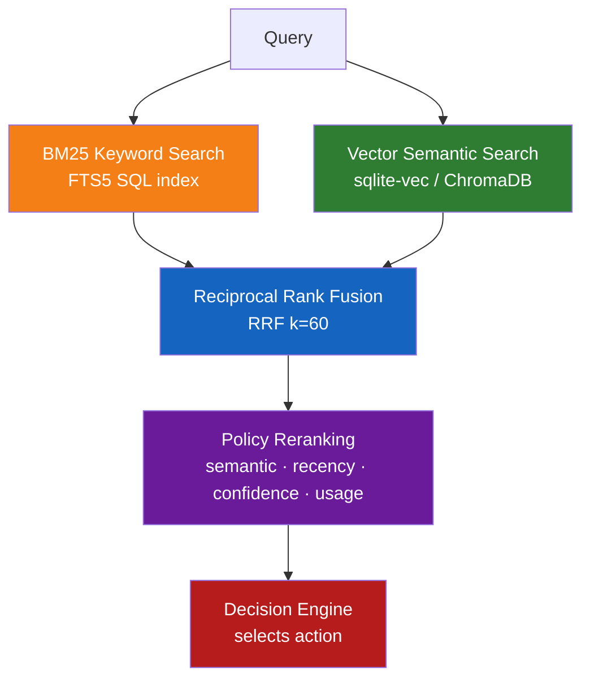

# Features

## Decision-Based Memory

Memory is **not automatically injected**. Every `resolve()` returns one of four explicit actions:

| Action | Behaviour | When it fires |
|--------|-----------|---------------|
| **REPLAY** | Return the stored answer verbatim | Exact or near-identical query with high confidence |
| **RESTORE** | Inject memory as LLM context | Similar query that needs adaptation |
| **VERIFY** | Flag for validation before reuse | Facts, workflows, tool outputs — or stale entries |
| **NONE** | Ignore memory entirely | Unrelated query; memory stays out of the way |

```python
decision = memory.resolve("How do I reset my password?")
# decision.action  → MemoryAction.REPLAY
# decision.confidence → 0.92
# decision.response   → "Go to Settings → Security → Reset Password."
print(decision.explain())  # per-component score breakdown
```

---

## Hybrid Retrieval Pipeline



**Policy weight defaults** (customisable — see [Policies](policies.md)):

| Factor | Weight | Note |
|--------|--------|------|
| Semantic + keyword similarity | 55% | Combined BM25 + vector score |
| Confidence | 20% | Set at `remember()` time; updated by `ConfidenceLearner` |
| Recency | 15% | Exponential decay, half-life 30 days |
| Usage frequency | 10% | Access count incentive |

---

## Storage Backends

| Backend | Extra | Retrieval | Best for |
|---------|-------|-----------|----------|
| `sqlite` *(default)* | *(none)* | FTS5 BM25 + coverage scaling | Zero-setup, fast, no server |
| `sqlite` + vectors | `[semantic]` | sqlite-vec KNN + FTS5 hybrid | Paraphrase robustness without a server |
| `chromadb` | *(bundled)* | Vector embeddings + Python BM25 | Existing ChromaDB deployments |
| `redis` | `[redis]` | RedisVSS HNSW KNN + RediSearch BM25 | Shared state across processes, fastest server backend |
| `postgres` | `[postgres]` | tsvector FTS + pgvector HNSW KNN | Production SQL databases |
| `qdrant` | `[qdrant]` | Qdrant HNSW KNN + full-text BM25 | A corpus past what a general-purpose database serves; dedicated vector tier |

Start every service locally:

```bash
docker compose -f docker-compose.dev.yml up -d
```

### Vector search per backend

Every backend's `search()` needs two things to be genuinely semantic: an
embedding model (`[semantic]`) and a vector index on the server side. Miss either
and `search()` silently becomes `keyword_search()` — check
`memory.store.semantic_search_enabled` to see which path you are on.

| Backend | Index | Server requirement | Without it |
|---------|-------|--------------------|------------|
| `sqlite` | sqlite-vec `vec0`, cosine | `[semantic]` extra only | Lexical FTS5 |
| `redis` | RediSearch HNSW (`m=16`, `ef_construction=200`) | Redis 8+ or Redis Stack, **db 0** | Python BM25 |
| `postgres` | pgvector `hnsw` (`m=16`, `ef_construction=64`), IVFFlat below pgvector 0.7 | `CREATE EXTENSION vector` | tsvector FTS |
| `qdrant` | Qdrant HNSW (`m=16`, `ef_construct=100`) | Vector-native, nothing to enable | Payload-only collection, BM25 |

Postgres picks its index at init: HNSW when the server's pgvector is ≥ 0.7.0,
IVFFlat otherwise. Unlike IVFFlat, HNSW accepts online inserts and does not need
a populated table at build time, and its latency stays roughly flat as the corpus
grows where IVFFlat's climbs linearly — [measured
here](benchmarks.md#pgvector-hnsw-vs-ivfflat). Force either with
`PostgresMemoryStore(vector_index="hnsw" | "ivfflat")`; an existing IVFFlat index
is dropped when HNSW replaces it, so the column never carries two indexes.

### Tuning the index

All three HNSW backends take the same config object, so the knobs do not change
shape when you change backend. Defaults are each engine's own recommendation —
pass nothing and nothing changes.

```python
from agent_memory import Memory, VectorIndexConfig

# ef_search is the cheap knob: query-time only, nothing to rebuild.
Memory(backend="qdrant", vector_config=VectorIndexConfig(ef_search=512))

# m / ef_construction shape the graph itself, so they apply when it is built.
Memory(backend="redis", vector_config=VectorIndexConfig(m=32, ef_construction=400))
```

| Field | Default | Effect |
|---|---|---|
| `m` | 16 | Graph out-degree. Higher = better recall and faster search, larger index, slower build. |
| `ef_construction` | 64–200 (per engine) | Build-time candidate list. Higher = permanently better recall, slower inserts. |
| `ef_search` | 64 (128 on Qdrant) | Query-time candidate list. The knob to reach for when a filtered query returns fewer hits than it should. |
| `overfetch` / `min_candidates` | 4 / 20 | How much deeper than `top_k` to pull, so Python-side expiry filtering still leaves `top_k` survivors. |

Postgres additionally takes `ivfflat_config=IvfFlatConfig(lists=…, probes=…)` for
servers below pgvector 0.7. Scale `lists` with row count (pgvector suggests
`rows / 1000`) and keep `probes` well under it — at `probes == lists` every list
is visited and the index degenerates into a brute-force scan.

Read `store.vector_config` to see what a store is actually using.

### Adding a backend

Backends resolve through a registry, so a custom store needs no change to the SDK:

```python
from agent_memory import Memory, register_backend

register_backend("mystore", lambda ctx: MyStore(**ctx.kwargs))
Memory(backend="mystore", host="…")     # kwargs reach the factory verbatim
```

`available_backends()` lists what is registered. Factories import their driver
lazily, so `import agent_memory` never pulls in psycopg2 or qdrant-client.

> **Honesty note:** Without `[semantic]`, sqlite's search is lexical. Paraphrases with no shared words
> need `[semantic]`, `chromadb`, or one of the vector-indexed server backends above.

---

## Memory Types & Scopes

**Types** control how the decision engine treats a memory:

| Type | Behaviour |
|------|-----------|
| `conversation` | Standard replay/restore |
| `fact` | Triggers VERIFY when confidence drops below the verify threshold or memory ages |
| `workflow` | Triggers VERIFY when stale |
| `tool_output` | Triggers VERIFY when stale or below the verify threshold; pair with `ttl=` for automatic expiry |
| `document` | Long-form content, always RESTORE |
| `code` | Code snippets |
| `summary` | Consolidated memory (created by `consolidate()`) |
| `preference` | User settings, high replay priority |

**Scopes** classify how broadly a memory applies; they are not tenant
identifiers. Use `Memory.scoped(user_id=..., session_id=...)` for per-user and
per-session read/write isolation. Derive those IDs from authenticated
application context, not untrusted request fields. See [Tenants and sessions](memory-model.md#tenants-and-sessions).

`session` · `user` · `project` · `workspace` · `team` · `global`

```python
memory.remember(query, response, type="fact", scope="project")
entries = memory.list(scope=["user", "global"])
decision = memory.resolve(query, scope=["user", "global"])
```

---

## Time-to-Live (TTL)

```python
memory.remember(query, response, ttl="30d")   # expires after 30 days
memory.remember(query, response, ttl="2h")    # expires after 2 hours
memory.remember(query, response, ttl=3600)    # expires after 3600 seconds

memory.cleanup()           # mark expired entries as expired
memory.cleanup(delete=True)  # permanently delete them
```

---

## Confidence Learning

Confidence tracks how much to trust a memory. It starts at `1.0` and updates via feedback events:

```python
from agent_memory import ConfidenceLearner, ConfidenceEvent

learner = ConfidenceLearner()
update = learner.record_event(entry, ConfidenceEvent.VERIFIED_INCORRECT)
# entry.confidence lowered by 0.20
memory.store.update(entry)

# Nightly temporal decay (half-life 90 days)
for e in memory.list():
    learner.decay(e)
    memory.store.update(e)
```

Events: `ACCESSED` · `VERIFIED_CORRECT` · `VERIFIED_INCORRECT` · `USER_CONFIRMED` · `USER_REJECTED` · `STALE`

---

## Memory Graph

Discover relationships between stored memories:

```python
from agent_memory import MemoryGraph

graph = MemoryGraph.build(memory.store, similarity_threshold=0.4)
neighbours = graph.neighbors(entry_id, min_weight=0.5)
path      = graph.path(source_id, target_id)    # BFS shortest path
clusters  = graph.clusters(min_weight=0.4)       # connected components
scores    = graph.importance_scores()            # PageRank
export    = graph.to_dict()                      # JSON for d3.js / Gephi
```

---

## Multi-Agent Support

Multiple agents share one store with configurable isolation:

| Mode | `list()` returns | Use case |
|------|-----------------|---------|
| `NAMESPACED` *(default)* | own + global | Most agent setups |
| `ISOLATED` | own only | Strict per-agent privacy |
| `SHARED` | everything | Admin / monitoring agents |

```python
from agent_memory import Memory, MultiAgentMemory
from agent_memory.multiagent import IsolationMode

shared = Memory(persist_dir=".agent_memory")
agent  = MultiAgentMemory(shared, agent_id="support", isolation=IsolationMode.NAMESPACED)

agent.broadcast("company name", "Acme Corp")        # visible to all agents
agent.transfer_memory(entry_id, "another-agent")    # transfer ownership
```

---

## Observability

```python
decision = memory.resolve(query)

decision.action        # REPLAY | RESTORE | VERIFY | NONE
decision.confidence    # 0.0–1.0
decision.reasons       # ["high semantic match", "recent memory", …]
decision.scores        # {"semantic": 0.91, "recency": 0.85, …}

print(decision.explain())   # full human-readable score breakdown
```

---

## Consolidation

Merge near-duplicate memories into summaries:

```python
created = memory.consolidate(similarity_threshold=0.95)
# Archived the originals, returned new SUMMARY entries
```

---

## Paged Context (Hierarchical Memory)

MemGPT/Letta-style context tiers that keep in-session context bounded instead of
growing until it rots. Recent turns live in a fixed-size in-context buffer; when
the buffer fills, the oldest turns page out to recall storage and come back only
when a query semantically matches them. Archived entries form a third, cold tier
searched on explicit request.

```python
paged = memory.paged(context_size=20, recall_top_k=5)

# Add turns — old entries page out to recall automatically
paged.add_turn("What is Python?", "A programming language.")
paged.add_turn("Favourite framework?", "FastAPI.")

# Bounded, query-relevant context for the next LLM call
ctx = paged.get_context("Tell me about Python")
prompt_block = ctx.format_for_llm()   # in-context buffer + matching recall entries

paged.search_archive("Python version history")  # explicit cold-tier search
paged.flush_to_recall()                          # page everything out at session end
```

---

## Conversation Distillation

Extract durable facts, preferences, and entities from a conversation turn and store
them automatically — so knowledge survives the session instead of dying with the
context window. Only candidates above `min_confidence` are stored.

```python
entries = memory.from_conversation(
    human="My name is Karan and I prefer Python.",
    assistant="Got it!",
)
# → stored entries for the name and the language preference,
#   each typed, tagged, and confidence-scored by the EntityExtractor
```

The extractor's prompt-injection patterns are heuristic and cannot establish
whether arbitrary text is trustworthy. For tool output, retrieved documents,
and other externally controlled turns, pass `source_trusted=False` to reject
the whole turn instead of relying on pattern matches:

```python
entries = memory.from_conversation(
    human=tool_output,
    assistant=summary,
    source_trusted=False,
)
# → [] and nothing from this turn is persisted
```

Only submit externally sourced facts as trusted input after your application
has independently validated and explicitly promoted them.
